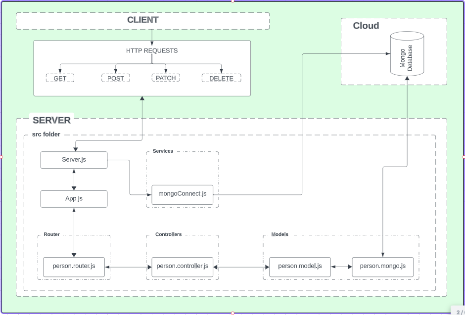

# hngx-stage-2

This is the stage two task for the HNGX program. Wish me well, thanks.

# Table of Contents

<ol>
    <li>Objective</li>
    <li>Features</li>
    <li>Prerequisites</li>
    <li>Installation</li>
    <li>Usage</li>
    <li>API Documentation</li>
    <li>UML Diagram</li>
</ol>

# Objective:

Build a simple REST API capable of CRUD operations on a "person" resource, interfacing with any database of your choice. Your API should dynamically handle parameters, such as adding or retrieving a person by name. Accompany the development with UML diagrams to represent your system's design and database structure.  Host your entire project on GitHub, and provide a well-structured documentation in the repository that outlines request/response formats, setup instructions, and sample API usage.


## Features

- Create a new resource
- Retrieve/Read existing resources
- Update existing resources
- Delete resources

## Prerequisites

To run this API locally, you need to have the following installed:

- Node.js (version 18.13.0)
- npm (version 8.19.3)
- Mongoose (version 7.5.0)

## Installation

1. Clone the repository:

```bash
git clone https://github.com/Richard-githome/hngx-stage-2.git
```

2. Install dependencies:

```bash
cd hngx-stage-2
npm install
```

3. Set up environment variables:

Create a `.env` file in the root directory and provide the following variables:

```
PORT=3000
MONGO_URL=mongodb+srv://username:<password>@cluster0.n1m2cz0.mongodb.net/{name-of-the-database}?retryWrites=true&w=majority
```

4. Start the server:

```bash
npm start
```

The API will be available at `http://localhost:3000/api`.

## API Documentation

The following endpoints are available:

- `GET /api` : Retrive all persons(array) from the database.
- `GET /api/:user_id` : Retrives a person object from the database, either by the serial number or name value.
- `POST /api` : Saves a person object to the database.
- `PATCH /api/:user_id` : Updates a person object in the database.
- `DELETE /api/:user_id` : Deletes a person object from the database.

## UML Diagram

<div align="center">

</div>